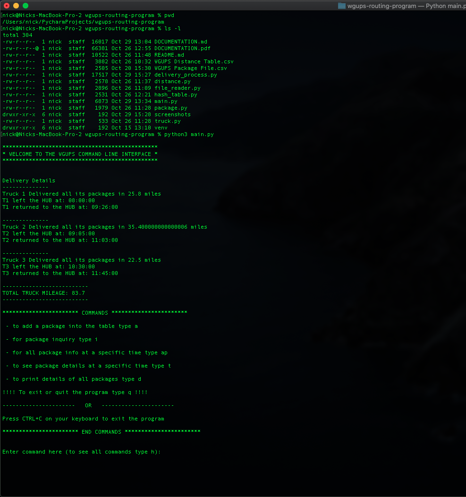

# WGUPS ROUTING PROGRAM

#### The following is a detailed outline of the rubric requirements for this project

## A: Algorithm Selection

This program utilizes the 2-opt search algorithm to try and find the shortest path between addresses.
The 2-opt algorithm tries to organize a route so that it does not cross over itself, which in turn
can find an optimal path. The 2-opt algorithm runs in `O(n^2)` similar to the NN algorithm but to me 
it seems like a more elegant solution to this problem. My goal was to keep my runtime around
`O(n^2)` otherwise I could've chosen 3-opt which runs in `O(n^3)`

code for my 2-opt is in `delivery_process.py @ line 221`

## B1: Logic Comments
The following explanation describes the process of how my program solves this problem:
```text
The Western Governors University Parcel Service (WGUPS) needs to determine the best route and delivery distribution for their Daily Local Deliveries (DLD) because packages 
are not currently being consistently delivered by their promised deadline. The Salt Lake City DLD route has three trucks, two drivers, and an average of 40 packages to deliver 
each day; each package has specific criteria and delivery requirements.

Your task is to determine the best algorithm, write code, and present a solution where all 40 packages, listed in the attached “WGUPS Package File,” will be delivered on time 
with the least number of miles added to the combined mileage total of all trucks. The specific delivery locations are shown on the attached “Salt Lake City Downtown Map” and 
distances to each location are given in the attached “WGUPS Distance Table.”

While you work on this assessment, take into consideration the specific delivery time expected for each package and the possibility that the delivery requirements—including the 
expected delivery time—can be changed by management at any time and at any point along the chosen route. In addition, you should keep in mind that the supervisor should be 
able to see, at assigned points, the progress of each truck and its packages by any of the variables listed in the “WGUPS Package File,” including what 
has been delivered and what time the delivery occurred.

The intent is to use this solution (program) for this specific location and to use the same program in many cities in each state where WGU has a presence. As such, you will need to 
include detailed comments, following the industry-standard Python style guide, to make your code easy to read and to justify the decisions you made while writing your program.
```

### Solution Explanation

##### Load/store package data given to us in an excel/csv format
- Read the csv file to parse each data row.
- Take those parsed rows and create a package object.
- Store those package objects into a hash table.

##### Load/store distance data given to us in an excel/csv format
- Read the csv file to parse each data row.
- Clean the parsed data so that it is usable.
- Store the data so that it is easily iterable/retrievable.

##### Run the main program that delivers the packages 
- A call to the `deliver_packages()` will instantiate three truck objects, then using the those truck objects
along with package data will sort package objects into truck 1, 2, or 3 based on constraints. 
- While trucks are sorted with packages, address list are created and stored with which addresses will need 
to be visited with a certain truck.
- Once the trucks are loaded with packages and each truck has a list of addresses to visit the list of addresses
are optimized using the distance data loaded earlier.
- To optimize the addresses each list is passed into the `optimize()` function that will look at each address and
iteratively run a 2-opt swap then compare the distance total to the previous version of the route. If the new version 
is shorter that becomes the best route. The 2-opt swap essentially swaps every addresses with every other address until
an optimal route is found.
- Each time a route is 2-opt swapped it is run through the `cost()` function which totals the distance to visit each address
in the given address list starting at index 0.

#### Command Line Interface (CLI)
- The rest of the program utilizes a CLI so that end users can do the following things:
- insert a package into the hash table
- look up a package by id
- look up a package by id and time
- see details of all packages

## B2: Application of Programming Models
This section does not directly apply to this project any longer. This is due to all the data being stored 
locally within the project itself via the two csv files. 

## B3: Space-Time and Big-O
The runtimes for each major block of code can be found in the comment blocks associated to each block.

The total run time for this project is: `O(n^2)`

## B4: Adaptability
This program should have no problem taking in larger sets of data as it sits right now. The algorithm used 
is fully scalable to accept any size of list. As long as addresses have a corresponding distance to each other
address then any amount of data could be run through the program. 

Of course if the data sets grew exponentially the program would eventually begin to slow down and a more optimized
solution would be a good investment.

## B5: Software Efficiency and Maintainability
This program is efficient because it is able to run in polynomial.

Due to the organization and detailed documentation associated with this program any programmer 
should be able to take this project and enhance or repair as they see fit.

## B6: Self-Adjusting Data Structures
The hash table that stores the package data is the main self-adjusting data structure used in this 
program. This data structure has 4 functions
`__init__()`
`add()`
`get()`
`_hash_key()`

The `__init__()` function will initialize the data structure using a given size parameter. For this program
I choose to have the hash table double in size on initiation. Which may have to be revised if the program begins
to hold larger data sets.

## C: Original Code
When running the program from the CLI the initial output will look like this:

Input
```commandline
python3 main.py
```

Output
```commandline
***********************************************
* WELCOME TO THE WGUPS COMMAND LINE INTERFACE *
***********************************************


Delivery Details
--------------
Truck 1 Delivered all its packages in 27.8 miles
T1 left the HUB at: 08:00:00
T1 returned to the HUB at: 09:32:40 

--------------
Truck 2 Delivered all its packages in 35.400000000000006 miles
T2 left the HUB at: 09:05:00
T2 returned to the HUB at: 11:03:00 

--------------
Truck 3 Delivered all its packages in 22.5 miles
T3 left the HUB at: 10:30:00
T3 returned to the HUB at: 11:45:00 

--------------------------
TOTAL TRUCK MILEAGE: 85.7
--------------------------

*********************** COMMANDS ***********************

 - to add a package into the table type a

 - for package inquiry type i

 - to see package details at a specific time type t

 - to print details of all packages type d

!!!! To exit or quit the program type q !!!!

----------------------   OR   ----------------------

Press CTRL+C on your keyboard to exit the program

*********************** END COMMANDS ***********************


Enter command here (to see all commands type h):
```

As seen in the above section the program executes the delivery process delivering all the packages in a total
mileage of `85.7` miles

In order to see at what time each package was delivered use the following input command:

```commandline
details
```

Output sample:
```commandline
['1', Package Info - ID: 1, ADDRESS: 195 W Oakland Ave, CITY: Salt Lake City, STATE: UT, ZIP: 84115, DELIVERY TIME: 10:30 AM, WEIGHT: 21, STATUS: Delivered at 08:14:40, NOTES: ]
['2', Package Info - ID: 2, ADDRESS: 2530 S 500 E, CITY: Salt Lake City, STATE: UT, ZIP: 84106, DELIVERY TIME: EOD, WEIGHT: 44, STATUS: Delivered at 10:52:20, NOTES: ]
['3', Package Info - ID: 3, ADDRESS: 233 Canyon Rd, CITY: Salt Lake City, STATE: UT, ZIP: 84103, DELIVERY TIME: EOD, WEIGHT: 2, STATUS: Delivered at 10:33:00, NOTES: Can only be on truck 2]
['4', Package Info - ID: 4, ADDRESS: 380 W 2880 S, CITY: Salt Lake City, STATE: UT, ZIP: 84115, DELIVERY TIME: EOD, WEIGHT: 4, STATUS: Delivered at 08:18:20, NOTES: ]
.
.
.
```

You can see in the `STATUS` area of the package info that it states at what time the package was delivered

## C1: Identification Information
This information also exist in `main.py`

```pydocstring
# ******** IDENTIFICAION INFORMATION ********
# * First Name: Nicholas                    *
# * Last Name: Giegerich                    *
# * ID: 001059303                           *
# *                                         *
# *******************************************
```

## C2: Process and Flow Comments
Please see each major block of code for comments

## D: Data Structure
The data structure used to store package data is a python list made to mimic the 
functionality of a hash table.

## D1: Explanation of Data Structure
The following are the insert and look up functions:

```python
def add(self, key, value):
    """
    adds a package to the list (hash table) if that index is None,
       if that index is not None then that package already exist,
    for this program we are assuming all packages have a unique ID

    :rtype: bool
    :param key: unique ID
    :param value: a package object
    :return: True if added, False otherwise
    """
    hashed_key = self._hash_key(key)
    kvp = [key, value]

    if self.list[hashed_key] is None:
        self.list[hashed_key] = list(kvp)
        return True
    else:  # we have a collision
           print('ERROR: that package id already exist')
        return False
def get(self, key):
    """
    gets a singular package by the ID (key),
    if that ID is None then there is no package there
    :rtype: object
    :param key: unique key
    :return: value associated to key, otherwise False
    """
    try:
        hashed_key = self._hash_key(key)
        kvp = self.list[hashed_key]

        if self.list[hashed_key] is None:
            return False
        else:
            return kvp[1]
    except IndexError:
        return False
```
The `add()` function is meant to take a key (package id) and value (package object).

The `get()` function takes in a package id and returns that package object in `O(1)` time.

This proves very useful in quickly grabbing package info for displaying or comparing in other
parts of the program.

## E: Hash Table
See part D above for the insert function of the hash table. 

Since the hash table takes in an object that is made up of package values the proper way to use this
insert function would be similar to the example below:

```python
...
# use a unique key
key = packaage_id

# construct a package object 
p = Package(package_id, address, city, state, zip_code, delivery_time, weight, status, notes)

# add the key/values to the hash table
hash_table.add(key, p)
...
```

## F: Look-Up Function
See part D for the code behind the look up function.

Since every package id in out program is unique we can use that as our hash key. See the example below
for how the look up function works:

```python
package_id = 1
hash_table.get(package_id)
```

output
```commandline
['1', Package Info - ID: 1, ADDRESS: 195 W Oakland Ave, CITY: Salt Lake City, STATE: UT, ZIP: 84115, DELIVERY TIME: 10:30 AM, WEIGHT: 21, STATUS: Delivered at 08:14:40, NOTES: ]
```

## G: Interface
The interface for this program is a simple CLI. See section `C: Original Code` for details on 
how this works.

## G1-G3: 1st, 2nd, and 3rd Status Checks
#### Screenshot of package 39 at 8:40 am 
see the last 5 lines of the screenshot

#### Screenshot of package 39 at 9:45 am 
see the last 5 lines of the screenshot

#### Screenshot of package 39 at 12:30 pm 
see the last 5 lines of the screenshot


## H: Screenshots of Code Execution
#### Screenshot shows the current path, files in directory, and the program running


## I1: Strengths of The Chosen Algorithm
The strengths of the 2-opt algorithm are the speed the ability to solve the 
given problem and the ease of implementation. 

With a time complexity of `O(n^2)` it is able to solve the problem in polynomial time.

2-opt is also a known algorithm for solving the Travelling Salesman Problem (TSP).
Since this package deliver system is much like the TSP, this algo is a good choice.

Ease of implementation is also strength, the most complex part of the algorithm is
writing a cost function that will work for someones problem.

## I2: Verification of Algorithm
Verification that the algorithm works can be seen above in the provided screenshots 
or by running the program.

## I3: Other Possible Algorithms
Other algorithms to solve this problem could be:
- 3-opt
- Nearest Neighbor
- variation of Dijkstra's

## I3A: Algorithm Differences
#### 3-opt as a potential solution
using 3-opt would also solve the problem at hand and may even produce
a lower total mileage. However, we do then sacrifice time because we would 
then run in `O(n^3)` which is less optimal.

#### Nearest Neighbor (NN) as a potential solution
using NN would provide solution in the same time as 2-opt, however the path
that NN would find would be less optimal than 2-opt. In that case 2-opt is 
a more elegant solution.

## J: Different Approach
If I were to approach this differently I might actually implement more than
one algorithm to solve the problem and use the CLI to choose which one to run
given how large a dataset is. This could help in finding really optimal routes 
for small data sets and decently good routes for really big data sets.

## K1: Verification of Data Structure and Solution
See sections C, D1, E, and F for verification that I am using a hash table
to solve the problem and that my solution solves the problem in under `145` miles.

## K1A: Efficiency
The hash table being used to hold package objects make the program efficient
by allowing package attributes to be updated in constant time as they are being 
delivered. 

## K1B: Overhead
For handling the data we are able to achieve a constant time complexity
since we have built a hash table. This means retrieval and storage of data
happens in constant time. 

Since this program is run from a local machine the only memory or bandwidth
concerns remain within your local environment.

## K1C: Implications
Eventually adding more packages trucks and routes into the program will begin 
to slow the process time significantly. In order to scale up this program a 
proper backend and more object oriented programming could help keep the program 
running efficiently.

## K2: Other Data Structures
Two other structures that could be used:
- Priority Queue
- Doubly Linked List

These structures could be used to store/retrieve package data

## K2A: Data Structures Differences
The Priority Queue (PQ) would slow the retrieval time of grabbing objects in the
end or middle of the list

The Doubly Linked List would also slow retrieval time to `O(n)`

## L: Sources
For referencing algorithms I used the following sources:

https://en.wikipedia.org/wiki/2-opt
https://en.wikipedia.org/wiki/Nearest_neighbour_algorithm

## M: Professional Communication
The above documentation walks through all aspects of the project and demonstrates
all the requirements being fulfilled and executed. For more details on how the program
runs please see the .py files included for all code and additional comments.

 


